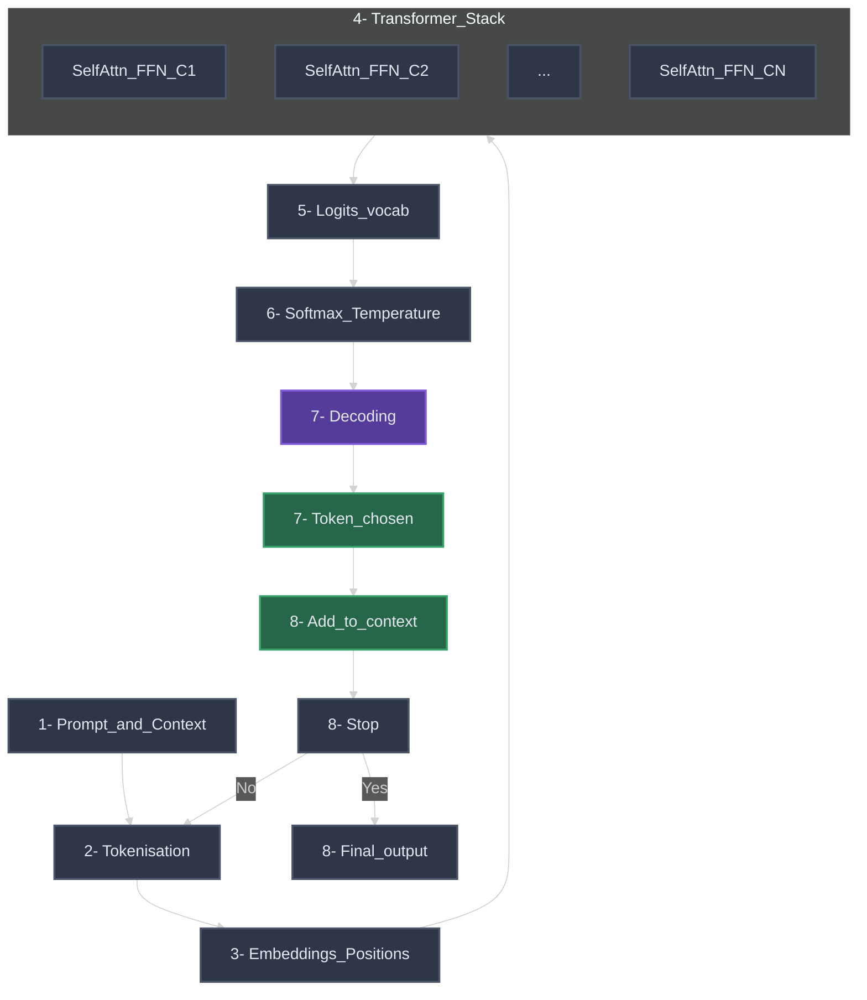
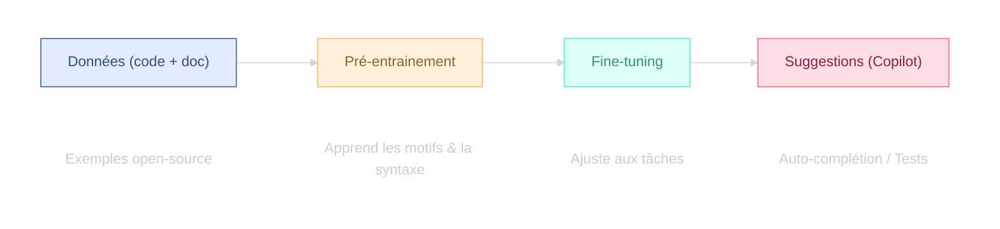
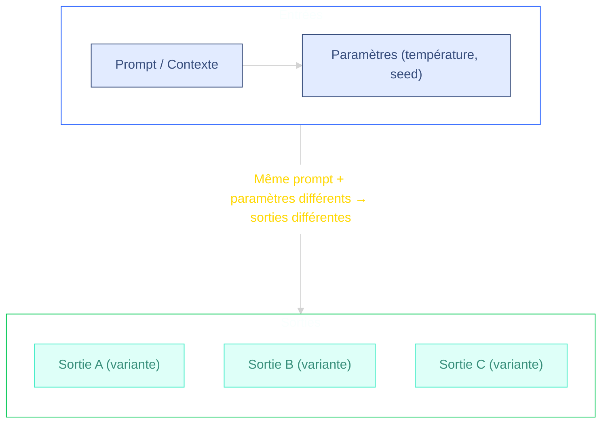
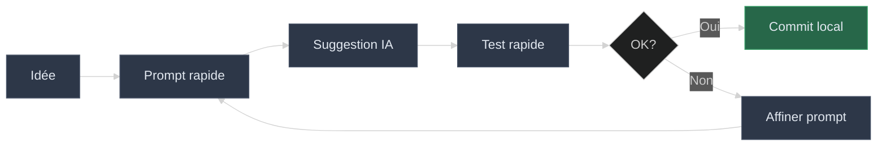
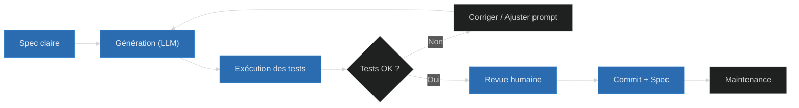

# Présentation : IA & LLMs pour coder

[↩️ Retour au README](README.md)

Objectif : donner une vue courte et pratique des principes des LLMs (Large Language Models) appliqués au code (ex. GitHub Copilot), ce qu'ils savent faire et leurs limites.

## 1) En une phrase

Les LLMs pour le code prédisent la suite la plus probable à partir du contexte (fichiers ouverts, commentaires, prompt) et suggèrent du code — ils accélèrent le développement, mais la relecture humaine reste indispensable.

Petit rappel utile : un LLM n'« exécute » pas le code pendant la génération. Il choisit des tokens plausibles selon son entraînement. Donc la qualité du prompt et du contexte guide fortement la précision et la pertinence des réponses.

### Note : c'est quoi un *token* ?

Un *token* est une petite unité de texte que le modèle manipule. Ce n'est pas toujours un mot entier : cela peut être un morceau de mot, un symbole, un espace ou une ponctuation.

Le modèle "voit" et prédit une séquence de tokens, pas des phrases complètes d'un coup.

Deux implications pratiques :

1. Longueur / coût : chaque token compte dans la fenêtre de contexte (limite de taille). Plus vous envoyez de texte, plus vous consommez de tokens.
2. Précision : des noms explicites (fonctions, variables) et des exemples réduisent l'ambiguïté des prochains tokens à prédire → meilleure qualité de sortie.

Astuce : si la réponse devient incomplète ou coupée, c'est parfois parce que la limite de tokens de sortie est atteinte.

### Comment un LLM prédit le prochain token (vue interne simplifiée)

Points importants : Copilot ne « comprend » pas le projet comme un humain ; il prédit la suite la plus probable en se basant sur des patterns vus pendant l'entraînement.

Le cycle principal de génération suit une chaîne déterministe (avec parfois de l'aléa dans l'échantillonnage) :

1. Tokenisation : le texte d'entrée est découpé en tokens (morceaux de mots / symboles).
2. Embeddings : chaque token est converti en vecteur dense (représentation numérique).
3. Position : on ajoute une information de position (sinusoïdale ou apprise) pour l'ordre.
4. Empilement de couches Transformer : chaque couche applique (a) self-attention (le token "regarde" les précédents) puis (b) un réseau feed-forward.
5. Logits : la dernière couche produit, pour chaque position courante, un score brut (logits) pour tout le vocabulaire.
6. Softmax + Température : transformation des logits en distribution de probabilités.
7. Échantillonnage / Décodage : on choisit le prochain token (greedy, top-k, nucleus, etc.).
8. Boucle : on ajoute ce token au contexte et on recommence jusqu'au stop (fin, longueur max, ou token spécial).

Diagramme (simplifié) :



Lecture rapide : le modèle ne produit pas un bloc entier d'un coup, mais un token à la fois, réévaluant la distribution complète à chaque itération.

## 2) Flux simplifié



Points clefs : pré-entrainement sur un large corpus, fine-tuning pour tâches spécifiques, et fenêtre de contexte limitée (longueur maximale). Ces limites expliquent pourquoi il faut fournir un contexte ciblé.


## 3) Usage concret de l'IA pour coder

- Auto-complétion (lignes, blocs, fonctions)
- Génération de tests unitaires et exemples d'utilisation
- Aide au refactoring et traduction entre langages
- **Génération de logiciels basés sur des exigences textuelles**

## 4) Pourquoi le contexte & la variabilité importent



- Contexte : noms de fonctions, commentaires, fichiers ouverts, exemples d'entrée/sortie.
- Variabilité : paramètres comme la "température" et la seed modifient les sorties (plus ou moins aléatoires).

Conseil pratique : fournir un prompt structuré, des exemples, et indiquer le format exact attendu.

## 5) Guide bref — Écrire un bon prompt (pour débutant)

Un bon prompt contient généralement ces éléments (ordre recommandé) :

1) Objectif clair : que doit produire l'IA ? (ex. "Écrire une fonction Java qui...")
2) Contrainte(s) : langage, version, style, performance, bibliothèques à utiliser ou à éviter.
3) Entrée(s) et sortie(s) attendues : schéma, types, exemples concrets.
4) Critères d'évaluation ou tests rapides : cas limite, complexité attendue, tests unitaires simples.
5) Exemple(s) : un petit exemple d'entrée → sortie pour guider le modèle.

Template court (à copier) :

"Tu es un assistant expert en [langage]. Objectif : [but précis]. Contraintes : [langage/version], ne pas utiliser [lib], respecter [style]. Entrée : [description]. Sortie attendue : [format]. Exemple : [entrée] → [sortie]."

Exemple concret :

"Tu es un assistant Java. Objectif : écrire une méthode statique 'truncate(String text, int n)' qui coupe une chaîne à n caractères en ajoutant '...' si nécessaire. Contraintes : Java 11+, pas de dépendance externe. Entrée : String, int. Sortie : String. Exemple : 'Bonjour', 3 → 'Bon...' ."

Pourquoi c'est important :

- Précision : plus vous donnez d'informations pertinentes (contraintes, exemples), plus la sortie sera proche de ce que vous attendez.
- Réduction des erreurs : indiquer des tests ou des cas limites aide le modèle à éviter les hallucinations.
- Itération rapide : commencez par un prompt précis, vérifiez la sortie, puis demandez des corrections ciblées (ex. "corrige pour les cas où...").

## 6) Limites rapides (à garder en tête)

- Hallucinations : le modèle peut inventer des fonctions, signatures ou APIs — toujours vérifier et exécuter le code.
- Licence / provenance : attention si vous intégrez du code sans vérifier la provenance.
- Sécurité : ne pas exposer de secrets ni de données sensibles dans les prompts.

## 7) Vibe Coding avec l'IA (exploration rapide)

Le "Vibe Coding" (codage par flux ou exploration assistée) désigne des micro-itérations très rapides où l'on génère, teste et ajuste du code avec l'IA sans concevoir immédiatement une solution formelle. Objectif : maximiser la vitesse d'apprentissage et de prototypage tout en limitant les risques (qualité, sécurité, licence).

### Quand l'utiliser

- Prototype / preuve de concept
- Exploration API / librairie inconnue
- Recherche de patterns de refactoring
- Génération d'idées de tests ou de cas limites

### Boucle typique (30–120s)



Clés :

- Prompt simple et ciblé
- Tester vite (unitaires / lint)
- Accepter si sûr, sinon ajuster le prompt
- Commit local puis structurer si besoin

> Cycle court — privilégiez petites itérations et feedback automatique.

## 8) Développement piloté par spécifications (Spec-Driven Development)

Le développement piloté par spécifications consiste à rédiger une spec claire (objectifs, interface, exemples, tests) avant de demander à un LLM de générer le code. C'est une approche utile pour les fonctionnalités critiques ou partagées où la fiabilité et la traçabilité sont importantes.

Principaux bénéfices :

- Clarifie les exigences et réduit les malentendus.
- Produit du code plus testable et maintenable.
- Facilite la revue collaborative et la traçabilité entre spec et code.

Checklist minimale pour une spec efficace :

1. Objectif bref et contexte
2. Signature / interface (types)
3. 2–3 exemples entrée→sortie
4. Tests essentiels / cas limites

Mini-template à copier :

```markdown
# Spec: [Nom]
## Contexte
Objectif : []
## Interface
- Langage: Java 11+
- Signature: `public static <Type> f(<params>)`
  (ex: `public static String truncate(String text, int n)`)
## Exemples
- Entrée: [...] -> Sortie: [...]
## Tests
- Cas nominal
- Cas limite
```

Workflow résumé : Rédiger spec → Générer via LLM → Exécuter tests → Revue humaine et commit.

### Workflow Spec-Driven avec LLM



### Quand privilégier Spec-Driven vs Vibe Coding

| **Critère** | **Spec-Driven** | **Vibe Coding** |
|-------------|----------------|-----------------|
| **Type de projet** | Production, bibliothèque partagée | Prototype, POC, exploration |
| **Criticité** | Code critique (sécurité, finance) | Expérimentation, apprentissage |
| **Équipe** | Collaboration multi-dev | Développement solo |
| **Documentation** | Requise et maintenue | Optionnelle |
| **Tests** | Complets et automatisés | Tests exploratoires |
| **Évolutivité** | Long terme | Court terme |

[💫 Toolkit to help you get started with Spec-Driven Development](https://github.com/github/spec-kit)

### (Annexe) Fenêtre de contexte : entrée / sortie (estimation)

Ce tableau indique, pour chaque modèle, une estimation de la fenêtre totale (tokens), puis une estimation typique de la quantité maximale utilisable pour l'entrée (tokens d'entrée) et pour la sortie générée. Rappel : entrée + sortie ≤ fenêtre totale.

| Modèle (exemples)         | Fenêtre totale (tokens) | Tokens d'entrée max (approx.) | Tokens sortie max (approx.) | Commentaire |
|---------------------------|------------------------:|------------------------------:|----------------------------:|------------|
| GPT-4.1 (Copilot)         | ≈128k                  | ≈96k–120k                     | ≈8k–32k                     | Intégré à Copilot, bon pour multi-fichiers et suggestions contextuelles |
| GPT-5 Mini                | ≈64k                   | ≈56k–60k                      | ≈4k–8k                      | Variante allégée de GPT-5, économique pour usages fréquents |
| Cloud Sonnet 4            | ≈200k                  | ≈176k–192k                    | ≈8k–24k                     | Conçu pour documents volumineux et code long |
| Cloud Sonnet 4.5          | ≈500k                  | ≈452k–488k                    | ≈12k–48k                    | Fenêtre étendue pour très grands contextes |
| GPT-5                     | ≈1M+                   | ≈800k–950k                    | ≈50k–200k+                  | Configurations endpoint-dependent ; forte capacité pour larges projets |
| Grok Code Fast 1         | ≈64k                   | ≈56k–60k                      | ≈4k–8k                      | Optimisé pour le code, faible latence pour suggestions rapides |
| Mistral (dernier)         | ≈64k (varie)           | ≈52k–60k                      | ≈4k–12k                     | Variantes optimisées pour le code et le coût |
| Llama 3 (dernier)         | ≈128k–512k             | ≈96k–480k                     | ≈8k–32k                     | Versions et builds variables (open-source/entreprise) |
| Gemini 2.5                | ≈1M                    | ≈800k–950k                    | ≈50k–200k+                  | Orienté très large contexte, utile pour projets multi-fichiers |

Note : estimations (oct. 2025) — les valeurs réelles dépendent de l'endpoint, des limites imposées par le fournisseur et des configurations de modèle. "Tokens d'entrée max" = fenêtre totale − tokens réservés pour la sortie ; les plages données indiquent des allocations typiques selon usage (conservateur → agressif).

Astuce pratique : si vous avez besoin d'analyser de longs dépôts, privilégiez les modèles à grande fenêtre ou prétraitez / résumez le code pour n'envoyer que les parties essentielles (signatures, tests, exemples).

---
