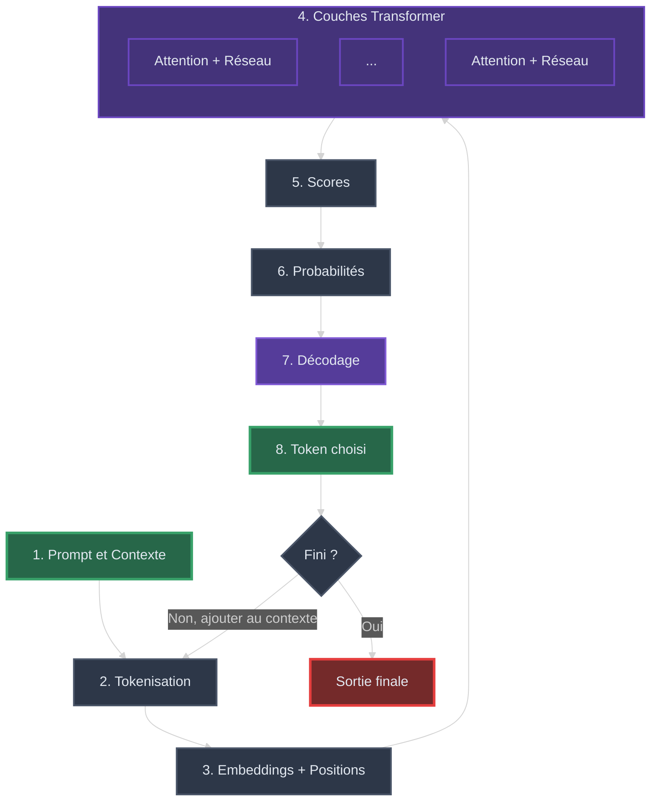
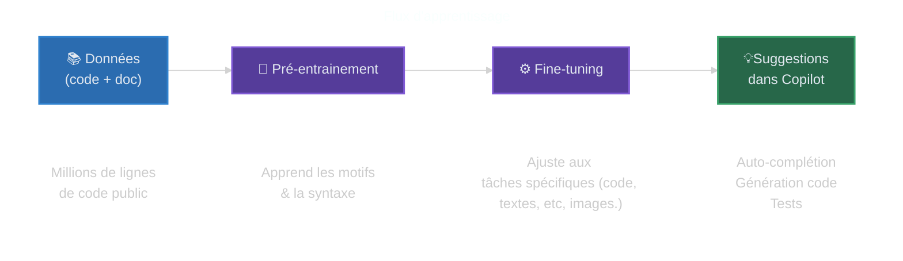
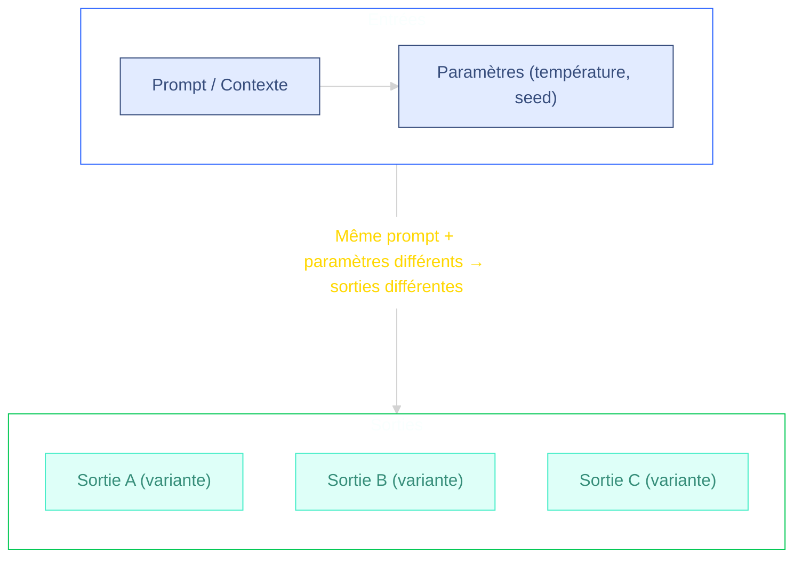
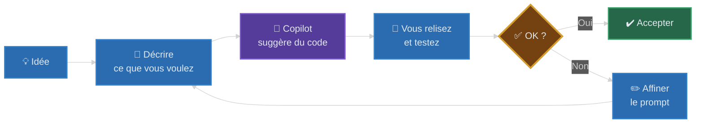
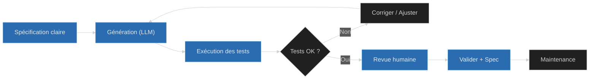

# Présentation : L'IA pour coder avec GitHub Copilot

[↩️ Retour au README](README.md)

**⏱️ Durée estimée : 45–60 minutes**

Objectif : donner une vue courte et pratique des principes des LLMs (Large Language Models) appliqués à GitHub Copilot, ce qu'ils savent faire et leurs limites.

---

## 🎯 C'est quoi l'IA ? (en 2 minutes)

**L'Intelligence Artificielle (IA)** désigne des programmes capables d'imiter certaines capacités humaines : comprendre du texte, reconnaître des images, prendre des décisions.

### Analogie simple

Imaginez un **assistant très cultivé** qui a lu des millions de livres, de codes et de documents. Il peut vous aider à écrire, mais :
- Il ne « pense » pas vraiment — il prédit ce qui semble logique.
- Il peut se tromper ou inventer des choses.
- Il a besoin de vos instructions claires pour bien vous aider.

### Les types d'IA que vous rencontrerez

| Type | Description | Exemple |
|------|-------------|----------|
| **LLM** (Large Language Model) | Modèle entraîné sur du texte pour générer du langage | GPT-4, Claude, Copilot |
| **IA Générative** | Crée du contenu (texte, images, code) | DALL-E, Midjourney, Copilot |
| **IA de code** | Spécialisée pour aider à programmer | GitHub Copilot |

> 💡 **À retenir** : GitHub Copilot est un LLM spécialisé pour le code. Il prédit la suite la plus probable de ce que vous écrivez.

---

## 1) En profond : Comment fonctionne un LLM pour le code ?

Les LLMs pour le code prédisent la suite la plus probable à partir du contexte (fichiers ouverts, commentaires, prompt) et suggèrent du code — ils accélèrent le développement, mais la relecture humaine reste indispensable.

> ⚠️ **Point clé** : Un LLM n'« exécute » pas le code. Il prédit les tokens les plus plausibles selon son entraînement.

### C'est quoi un *token* ?

Un *token* est une petite unité de texte (≈ un morceau de mot, symbole ou ponctuation). Le modèle génère une séquence de tokens, pas des phrases complètes.

**Implications pratiques :**

1. Longueur / coût : chaque token compte dans la fenêtre de contexte (limite de taille). Plus vous envoyez de texte, plus vous consommez de tokens.
2. Précision : des noms explicites (fonctions, variables) et des exemples réduisent l'ambiguïté des prochains tokens à prédire → meilleure qualité de sortie.

Astuce : si la réponse devient incomplète ou coupée, c'est parfois parce que la limite de tokens de sortie est atteinte.

> 💡 **À retenir** : Un token ≈ un morceau de mot. Plus votre prompt est long, plus vous consommez de tokens. Soyez concis et précis !

### Comment un LLM prédit le prochain token (vue interne simplifiée)

<details open>
<summary>📚 <strong>Section technique — Cliquez pour développer</strong> (optionnel pour débutants)</summary>

#### Analogie : le jeu de devinette

Imaginez que vous jouez à deviner le prochain mot d'une phrase. Si quelqu'un dit « Il fait beau, je vais me promener dans le... », vous pensez probablement à « parc », « jardin » ou « quartier ». Le LLM fait pareil, mais avec des calculs mathématiques sur des millions d'exemples !

#### Le cycle de génération (simplifié)

**Voici comment le modèle génère du code, étape par étape :**

1. **Tokenisation** : Découpe votre texte en petits morceaux (tokens)
   - *Exemple* : `"fonction calculer"` → `["fonction", " ", "calcul", "er"]`

2. **Embeddings** : Convertit chaque token en nombres que l'ordinateur peut traiter
   - *Analogie* : Comme traduire des mots en coordonnées GPS pour les manipuler

3. **Positions** : Ajoute l'information de l'ordre des mots
   - *Pourquoi* : Le modèle doit savoir que "Java aime Pierre" ≠ "Pierre aime Java"

4. **Couches Transformer** : Le cœur du modèle qui analyse le contexte
   - **Attention** : Le token "regarde en arrière" pour comprendre le contexte
     - *Example* : Pour compléter `data.get___`, il regarde que `data` est une Map → propose `(key)`
   - **Réseau** : Calcule et transforme l'information pour extraire des patterns
     - *Analogie* : Comme un calculateur qui combine les indices trouvés

5. **Scores** : Calcule un score pour chaque mot possible du vocabulaire entier
   - *Example* : `public` (score: 0.8), `private` (score: 0.6), `banana` (score: 0.001)

6. **Probabilités** : Transforme les scores en pourcentages (0-100%)
   - *Example* : `public` (45%), `private` (35%), autres (20%)

7. **Décodage** : Choisit le prochain token selon une stratégie
   - **Greedy** : Toujours le plus probable
   - **Top-k** : Parmi les k meilleurs
   - **Nucleus** : Parmi ceux qui totalisent x% de probabilité

8. **Boucle** : Ajoute ce token au contexte et recommence jusqu'à la fin
   - Le nouveau token devient partie du contexte pour prédire le suivant

**Diagramme du cycle :**



</details>

> 💡 **À retenir** : Copilot génère le code token par token (mot par mot). Il prédit ce qui semble le plus probable, il ne "comprend" pas vraiment.

## 2) Flux d'apprentissage simplifié

**Diagramme du flux d'apprentissage :**


**Comment Copilot apprend à générer du code :**

1. **Données (code + documentation)** : Collecte massive de code source
   - *Sources* : Projets open-source (GitHub), documentation technique, exemples de code
   - *Volumes* : Milliards de lignes de code dans différents langages
   - *Diversité* : Du code débutant au code expert, différents styles et domaines

2. **Pré-entraînement** : Apprentissage des motifs et de la syntaxe
   - *Objectif* : Apprendre les patterns généraux de programmation
   - *Processus* : Le modèle lit des millions d'exemples et apprend à prédire le code suivant
   - *Résultat* : Comprend la syntaxe, les conventions, les patterns communs
   - *Analogie* : Comme apprendre à lire en lisant des milliers de livres

3. **Fine-tuning** : Ajustement aux tâches spécifiques
   - *Objectif* : Spécialiser le modèle pour des tâches précises (auto-complétion, génération de tests, etc.)
   - *Processus* : Entraînement supplémentaire sur des exemples ciblés
   - *Optimisation* : Améliore la qualité pour les cas d'usage courants
   - *Analogie* : Comme un médecin généraliste qui se spécialise en chirurgie

4. **Suggestions (Copilot)** : Utilisation en production
   - *Sur VS Code* : Auto-complétion en temps réel pendant que vous codez
   - *Dans le Chat* : Réponses à vos questions et génération de code
   - *Génération de tests* : Création automatique de tests unitaires
   - *Limitation* : Fenêtre de contexte limitée (ne voit qu'une partie de votre projet)


> 💡 **À retenir** : Copilot est entraîné sur des milliards de lignes de code, mais a une **fenêtre de contexte limitée**. C'est pourquoi donner un contexte clair et ciblé améliore grandement les résultats !


## 3) Usage concret de l'IA pour coder

Voici ce que GitHub Copilot peut faire pour vous :

| 🎯 Fonctionnalité | 📝 Description | ⌨️ Comment l'utiliser |
|------------------|----------------|----------------------|
| **Auto-complétion** | Suggère la suite de votre code | Tapez et attendez les suggestions grises |
| **Génération de fonctions** | Crée des fonctions complètes | Écrivez un commentaire décrivant la fonction |
| **Tests unitaires** | Génère des tests pour votre code | Demandez dans le chat : « génère des tests pour... » |
| **Refactoring** | Améliore et simplifie le code | Sélectionnez du code + demandez une amélioration |
| **Documentation** | Ajoute des commentaires explicatifs | Demandez : « documente cette fonction » |

> 💡 **À retenir** : Copilot est un assistant, pas un remplacement. Relisez et testez toujours le code généré !

## 4) Pourquoi le contexte & la variabilité importent

#### 📝 Notion clé : le "contexte"

Le **contexte** = tout ce que l'IA peut voir pour faire sa suggestion :

- Le fichier que vous éditez
- Les autres fichiers ouverts dans VS Code
- Vos commentaires et noms de variables
- Le prompt que vous écrivez


>L'espace de contexte inclu aussi **l'espace de travail interne de l'IA**




**Ce qui influence les résultats :**
- **Contexte** : noms explicites, commentaires clairs, fichiers ouverts, exemples concrets
- **Paramètres** : température (créativité) et seed (variabilité aléatoire)

> 💡 **À retenir** : Plus votre contexte est précis et structuré, meilleurs sont les résultats.

## 5) Guide bref — Écrire un bon prompt (pour débutant)

### 🔑 Les 6 ingrédients d'un bon prompt

Un bon prompt contient généralement ces éléments (ordre recommandé) :

```text
┌─────────────────────────────────────────────────────────┐
│  1. 🎯 OBJECTIF    → Que doit produire l'IA ?           │
│  2. ⚙️ CONTRAINTES → Langage, version, style            │
│  3. 📥 ENTRÉES     → Quelles données en entrée ?        │
│  4. 📤 SORTIES     → Quel format attendu ?              │
│  5. 💡 EXEMPLE     → Un cas concret entrée → sortie     │
│  6. ⚠️ CAS LIMITE  → Cas limite ou supplémentaire       │
└─────────────────────────────────────────────────────────┘
```

### Détails de chaque ingrédient

1) Objectif clair : que doit produire l'IA ? (ex. "Écrire une fonction Java qui...")
2) Contrainte(s) : langage, version, style, performance, bibliothèques à utiliser ou à éviter.
3) Entrée(s) et sortie(s) attendues : schéma, types, exemples concrets.
4) Critères d'évaluation ou tests rapides : cas limite, complexité attendue, tests unitaires simples.
5) Exemple(s) : un petit exemple d'entrée → sortie pour guider le modèle.
6) Cas limite(s) : mentionner des scénarios particuliers à gérer. (optionnel)

Template court (à copier) :

```text
"Tu es un assistant expert en [langage]. Objectif : [but précis]. Contraintes : [langage/version], ne pas utiliser [lib], respecter [style]. Entrée : [description]. Sortie attendue : [format]. Exemple : [entrée] → [sortie]."
```

**Exemple concret :**

```text
Tu es un expert codeur Java. Objectif : écrire une méthode statique 'truncate(String text, int n)' 
qui coupe une chaîne à n caractères en ajoutant '...' si nécessaire. 
Contraintes : Java 11+, pas de dépendance externe. 
Entrée : String, int. Sortie : String. 
Exemple : 'Bonjour', 3 → 'Bon...'
Test : Gérer le cas où n > longueur du texte.
```

> 💡 **À retenir** : Plus vous êtes précis (contraintes, exemples, cas limites), moins le modèle invente et meilleurs sont les résultats.

## 6) ⚠️ Limites rapides (à garder en tête)

> **Important** : Ces limites sont cruciales à comprendre avant d'utiliser Copilot !

| ⚠️ Limite | 📝 Description | ✅ Bonne pratique |
|-----------|----------------|-------------------|
| **🎭 Hallucinations** | Le modèle peut inventer des fonctions, signatures ou APIs qui n'existent pas | Toujours vérifier et exécuter le code |
| **📜 Licence / provenance** | Le code généré peut ressembler à du code sous licence | Vérifier la provenance avant intégration |
| **🔒 Sécurité** | Ne jamais exposer de données sensibles | Pas de mots de passe, clés API ou secrets dans les prompts |
| **🔄 Non-déterministe** | Deux fois le même prompt peut donner des résultats différents | Itérer et affiner vos prompts |

> 💡 **À retenir** : Copilot est un outil puissant mais faillible. Vous restez responsable du code que vous livrez !

## 7) Vibe Coding avec l'IA (exploration rapide)

Le "Vibe Coding" (codage par flux ou exploration assistée) désigne des micro-itérations très rapides où l'on génère, teste et ajuste du code avec l'IA sans concevoir immédiatement une solution formelle. Objectif : maximiser la vitesse d'apprentissage et de prototypage tout en limitant les risques (qualité, sécurité, licence).

### Quand l'utiliser

- Prototype / preuve de concept
- Exploration API / librairie inconnue
- Recherche de patterns de refactoring
- Génération d'idées de tests ou de cas limites

### Boucle typique (30–120s)



Clés :

- Prompt simple et ciblé
- Tester vite (unitaires / lint)
- Accepter si sûr, sinon ajuster le prompt
- Commit local puis structurer si besoin

> Cycle court — privilégiez petites itérations et feedback automatique.

## 8) Développement piloté par spécifications (Spec-Driven Development)

Le développement piloté par spécifications consiste à rédiger une spec claire (objectifs, interface, exemples, tests) avant de demander à un LLM de générer le code. C'est une approche utile pour les fonctionnalités critiques ou partagées où la fiabilité et la traçabilité sont importantes.

Principaux bénéfices :

- Clarifie les exigences et réduit les malentendus.
- Produit du code plus testable et maintenable.
- Facilite la revue collaborative et la traçabilité entre spec et code.

Checklist minimale pour une spec efficace :

1. Objectif bref et contexte
2. Signature / interface (types)
3. 2–3 exemples entrée→sortie
4. Tests essentiels / cas limites

Mini-template à copier :

```markdown
# Spec: [Nom]
## Contexte
Objectif : []
## Interface
- Langage: Java 11+
- Signature: `public static <Type> f(<params>)`
  (ex: `public static String truncate(String text, int n)`)
## Exemples
- Entrée: [...] -> Sortie: [...]
## Tests
- Cas nominal
- Cas limite
```

Workflow résumé : Rédiger spec → Générer via LLM → Exécuter tests → Revue humaine et commit.

### Workflow Spec-Driven avec LLM



### Quand privilégier Spec-Driven vs Vibe Coding

| **Critère** | **Spec-Driven** | **Vibe Coding** |
|-------------|----------------|-----------------|
| **Type de projet** | Production, bibliothèque partagée | Prototype, POC, exploration |
| **Criticité** | Code critique (sécurité, finance) | Expérimentation, apprentissage |
| **Équipe** | Collaboration multi-dev | Développement solo |
| **Documentation** | Requise et maintenue | Optionnelle |
| **Tests** | Complets et automatisés | Tests exploratoires |
| **Évolutivité** | Long terme | Court terme |

[💫 Toolkit to help you get started with Spec-Driven Development](https://github.com/github/spec-kit)

### (Annexe) Fenêtre de contexte : entrée / sortie (estimation)

Ce tableau indique, pour chaque modèle, une estimation de la fenêtre totale (tokens), puis une estimation typique de la quantité maximale utilisable pour l'entrée (tokens d'entrée) et pour la sortie générée. Rappel : entrée + sortie ≤ fenêtre totale.

| Modèle (exemples)         | Fenêtre totale (tokens) | Tokens d'entrée max (approx.) | Tokens sortie max (approx.) | Commentaire |
|---------------------------|------------------------:|------------------------------:|----------------------------:|------------|
| GPT-4.1 (Copilot)         | ≈128k                  | ≈96k–120k                     | ≈8k–32k                     | Intégré à Copilot, bon pour multi-fichiers et suggestions contextuelles |
| GPT-5 Mini                | ≈64k                   | ≈56k–60k                      | ≈4k–8k                      | Variante allégée de GPT-5, économique pour usages fréquents |
| Cloud Sonnet 4            | ≈200k                  | ≈176k–192k                    | ≈8k–24k                     | Conçu pour documents volumineux et code long |
| Cloud Sonnet 4.5          | ≈500k                  | ≈452k–488k                    | ≈12k–48k                    | Fenêtre étendue pour très grands contextes |
| GPT-5                     | ≈1M+                   | ≈800k–950k                    | ≈50k–200k+                  | Configurations endpoint-dependent ; forte capacité pour larges projets |
| Grok Code Fast 1         | ≈64k                   | ≈56k–60k                      | ≈4k–8k                      | Optimisé pour le code, faible latence pour suggestions rapides |
| Mistral (dernier)         | ≈64k (varie)           | ≈52k–60k                      | ≈4k–12k                     | Variantes optimisées pour le code et le coût |
| Llama 3 (dernier)         | ≈128k–512k             | ≈96k–480k                     | ≈8k–32k                     | Versions et builds variables (open-source/entreprise) |
| Gemini 2.5                | ≈1M                    | ≈800k–950k                    | ≈50k–200k+                  | Orienté très large contexte, utile pour projets multi-fichiers |

Note : estimations (oct. 2025) — les valeurs réelles dépendent de l'endpoint, des limites imposées par le fournisseur et des configurations de modèle. "Tokens d'entrée max" = fenêtre totale − tokens réservés pour la sortie ; les plages données indiquent des allocations typiques selon usage (conservateur → agressif).

Astuce pratique : si vous avez besoin d'analyser de longs dépôts, privilégiez les modèles à grande fenêtre ou prétraitez / résumez le code pour n'envoyer que les parties essentielles (signatures, tests, exemples).

---

## 📋 Résumé en 5 minutes

Si vous n'avez retenu qu'une chose de chaque section :

| # | Section | 💡 Point clé |
|---|---------|-------------|
| 🎯 | **C'est quoi l'IA** | Copilot est un assistant qui prédit, il ne pense pas |
| 1 | **En une phrase** | LLM = prédiction de la suite la plus probable |
| 2 | **Tokens** | Plus le prompt est court et précis, meilleur est le résultat |
| 3 | **Usage concret** | Auto-complétion, tests, refactoring, documentation |
| 4 | **Contexte** | Donnez des exemples et noms explicites |
| 5 | **Prompts** | 5 ingrédients : Objectif, Contraintes, Entrées, Sorties, Exemple |
| 6 | **Limites** | Vérifiez toujours le code généré ! |
| 7 | **Vibe Coding** | Prototypage rapide avec itérations courtes |
| 8 | **Spec-Driven** | Pour le code de production, spécifiez d'abord |

### 🚀 Prêt pour l'exercice pratique ?

Passez maintenant à la section [GitHub Copilot](COPILOT.md) pour découvrir les raccourcis et astuces pratiques, puis lancez-vous dans l'exercice !

---
